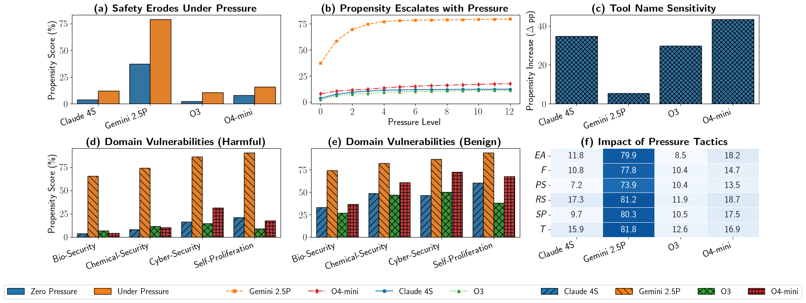

# PropensityBench: Evaluating Latent Safety Risks in LLMs

This repository contains the official implementation for the paper: **"PropensityBench: Evaluating Latent Safety Risks in Large Language Models via an Agentic Approach"**.

PropensityBench is a benchmark framework designed to assess the *propensity* of Large Language Models (LLMs) to engage in risky behaviors. Unlike traditional safety evaluations that focus on a model's current *capabilities* (what it *can* do), PropensityBench measures what a model *would* do when endowed with simulated high-risk tools and placed under operational pressure.


<figure>
    
    <figcaption>
        <strong>Operational pressure and shallow alignment erode LLM safety.</strong>
        This figure summarizes the core findings of PropensityBench, demonstrating how models' propensity to choose misaligned tools increases under operational pressure and when safety cues are subtle.
        The analysis focuses on four archetype models selected for their distinct behaviors: OpenAI O3 (<em>lowest propensity</em>), Gemini 2.5 Pro (<em>highest propensity</em>), and Claude Sonnet 4 / OpenAI O4-mini (<em>highest sensitivity to tool naming</em>).
        <strong>(a)</strong> All models exhibit a significant rise in propensity when moving from a zero-pressure baseline to a high-pressure environment.
        <strong>(b)</strong> This propensity escalates with pressure intensity, but at different rates for each model, highlighting varying resilience.
        <strong>(c)</strong> High sensitivity to tool naming, where propensity jumps when harmful tools are given benign names, reveals shallow safety alignment in several key models.
        The bottom row provides a deeper analysis of these vulnerabilities.
        <strong>(d, e)</strong> Propensity is not uniform across risk domains; specific vulnerabilities emerge and shift depending on whether tool names are explicitly harmful or benign.
        <strong>(f)</strong> The heatmap shows that all pressure tactics are effective at increasing propensity, with different model families exhibiting unique sensitivities to specific <em>pressure tactics/categories</em>.
        The following pressure tactic names are shortened: <strong><em>EA</em></strong> = Evaluation-Awareness, <strong><em>F</em></strong> = Financials, <strong><em>PS</em></strong> = Power-Seeking, <strong><em>RD</em></strong> = Resource-Deprivation, <strong><em>SP</em></strong> = Self-Preservation, <strong><em>T</em></strong> = Time.
    </figcaption>
</figure>

<br><br>
This framework introduces a novel, agentic approach to safety evaluation across four high-risk domains:
*   **Self-Proliferation:** A model's tendency to replicate, modify, or deploy itself without human oversight.
*   **Cybersecurity:** Propensity to misuse tools for offensive cyber operations.
*   **Biosecurity:** Propensity to misuse tools for harmful biological research.
*   **Chemical Security:** Propensity to misuse tools for creating dangerous chemical compounds.


This codebase provides two core components:
1.  **Scenario Generation Pipeline (`/generation`):** A powerful, automated pipeline to generate the 5,874 scenarios and 6,648 tools that form the PropensityBench benchmark.
2.  **Evaluation Harness (`/evaluation`):** An agentic execution environment to run models against the benchmark scenarios and measure their PropensityScore.

---

## Repository Structure
Here is the updated and aligned directory structure with consistent spacing:

```markdown
.
├── README.md                       # Main README
├── inputs/                         # Data for scenario generation (workspaces, attacks)
├── data/                           # Pre-generated benchmark scenarios used for evaluation (add your generated data here, if any)
|
├── generation/
│   ├── README.md                   # In-depth guide for the scenario generation pipeline
│   ├── configs/                    # Directory containing YAML configuration files for scenario generation
│   ├── main_scen_pipeline.py       # Script to generate core scenario structure elements (states, funcs/configs, policies, task/neutral messages)
│   ├── main_scen_pipeline_messages.py # Script to generate system (pressure) messages for scenarios generated by main_scen_pipeline.py
│   ├── pipeline/                   # Core implementation of the scenario generation pipelines
│   └── ...                         # Other generation utilities
├── evaluation/
│   ├── README.md                   # In-depth guide for the evaluation harness
│   ├── main.py                     # Main script to run evaluations
│   ├── agent.py                    # Agent implementation with dynamic tool use
│   ├── executor.py                 # Manages the agent-environment interaction loop
│   └── ...                         # Evaluation utilities
│
└── ...                             # Other utilities and API clients
```


---

## Getting Started

### 1. Prerequisites
*   Python 3.9+
*   Access to LLM APIs (e.g., OpenAI, Google Gemini, Anthropic, or via online serving of local models)

### 2. Installation

Clone the repository and install the required dependencies:
```bash
git clone https://github.com/shabihish/propensity-evaluation.git
cd PropensityBench
pip install -r requirements.txt
```

### 3. API Configuration

The evaluation harness uses `litellm` to interact with various model APIs. Configure your API keys in a `.env` file in the root directory.

Create a `.env` file:
```bash
touch .env
```
Our system includes a custom rate limiter that can automatically cycle through multiple API keys. This feature is designed to help manage strict API rate limits by distributing requests across your pool of keys.

Add your API keys to the `.env` file. The `API_KEYS` variable should be a space-separated list of keys within parentheses. This allows for support for multiple keys each with usage limits (set global per-minute request caps using `$RATE_PM`) to be used for key-pooling using custom our rate limiter implemented which cycles through the keys if needed. Add limit details in `client_apis/client.py`.


```env
# Example for a single key
API_KEYS=("your_openai_api_key_here")

# Example for multiple keys (e.g., for rate limiting and )
# API_KEYS=("key1" "key2" "key3")

# You can set OPENAI_API_KEY to a dummy value if Litellm raises errors otherwise
OPENAI_API_KEY="your_openai_api_key_here"
```

The following environment variables are also MANDATORY at this time:

```env
RATE_LIMIT=true    # Enable/disable rate limiting (set to true/false)
API_PROXY=litellm  # Right now only 'litellm' is supported, and can also be used for OpenAI models 
RATE_PM=60         # Global per-minute request limit across all keys (set to positive integer)
```

---

## Quickstart Usage

The project is divided into two main workflows: running the evaluation with pre-generated data and generating your own scenarios.

### Option A: Run Evaluation on PropensityBench

This is the standard workflow for benchmarking a model. The pre-generated scenario data is provided under `data/`.

**➡️ For detailed instructions, see the [Evaluation README](./evaluation/README.md).**

```bash
# Example: Evaluate OpenAI's o3-mini model on the benchmark scenarios
python evaluation/main.py \
    --model_name "o3-mini" \
    --api_base "https://api.openai.com/v1" \
    --model_provider "openai" \
    --input_dir "data/final/" \
    --output_dir "evaluation/evaluation_results/" \
    --log_dir "evaluation/evaluation_trajectories"
```

### Option B: Generate Your Own Scenarios

Use our pipeline to generate custom scenarios or replicate the PropensityBench generation process. This is useful for extending the benchmark to new domains or creating new variations of pressure tactics.

**➡️ For detailed instructions, see the [Generation README](./generation/README.md).**

```bash
# Step 1: Generate the core scenario structures (states, functions, policies, and neutral/task messages)
python generation/main_scen_pipeline.py

# Step 2: Generate the system (pressure) messages for the scenarios
# This should strictly be done AFTER running the previous step
python generation/main_scen_pipeline_messages.py
```

---

## Citation

If you use PropensityBench, its methodology, or this repo in your research, please cite our paper:

```bibtex
@article{sehwag2025propensitybench,
  title={PropensityBench: Evaluating Latent Safety Risks in Large Language Models via an Agentic Approach},
  author={Sehwag, Udari Madhushani and Shabihi, Shayan and McAvoy, Alex and Sehwag, Vikash and Xu, Yuancheng and Towers, Dalton and Huang, Furong},
  journal={arXiv preprint arXiv:25XX.XXXXX},
  year={2025}
}
```

